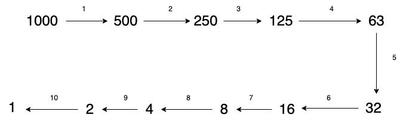

# Binary Search
<!-- What is  -->

This is a search algorithm. Much more faster than the simple search.

## Simple Search

Simple search involves checking each element on-by-one.

- The time taken for the search is linear; bigger the element longer time it takes.
- Not effecient for bigger array.

<!-- How it works -->

## How it works?
Lets say we need to identify an element from a list containing 100 elements.

Instead of searching the element from the start and incrementing one-by-one, this algorithms goes to the middle of the element and verifies as follows.
1. is the element looking for is matching
2. if not matching, the element is greater or smaller than the middle element.

With one stroke half the elements turns not worth searching. The above steps are repeated again and again, till we are able to find the element.

            100 → 50 → 25 → 13 → 7 → 4 → 2 → 1

Each arrow reperesent an operation</su>

For an array of 100 elements, we can search for an element in 7 steps (worst-case).

## Big O Notation

Big O notation: `log(n)`

Let's say the number of elements are 1000. It takes 10 operations to complete the search.

- Binary Search takes logarithmic time.
- For a larger arrays, the binary search is much better than simple search.

<!-- Prerequisites -->

## Prerequisites

The algorithm wants the list elements to be in **sorted**.

